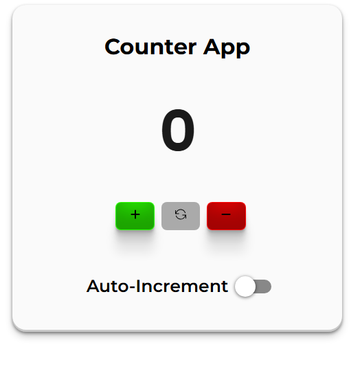
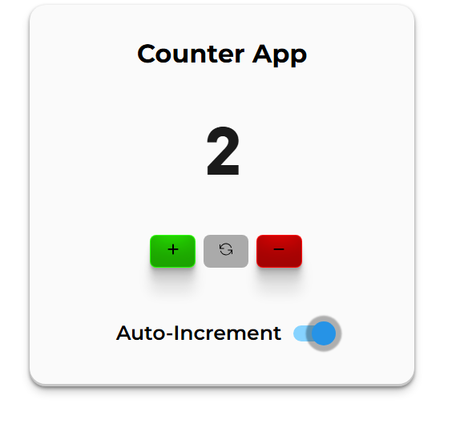
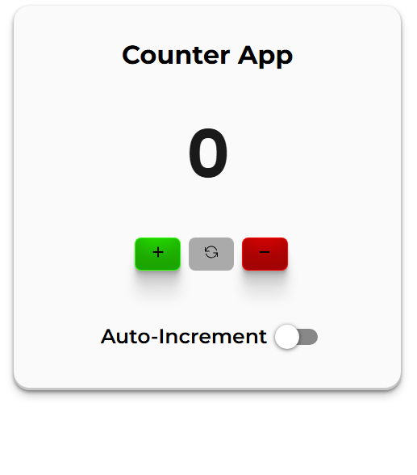
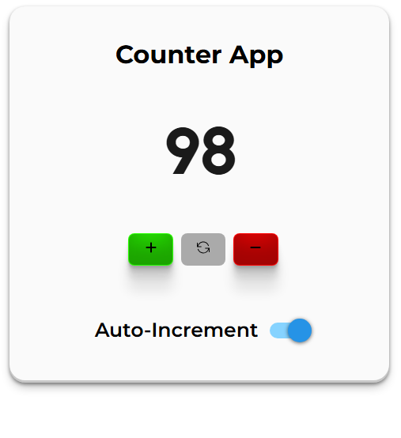

# CounterV2

CounterV2 is a counter application built using the MVI/MVVM architecture with reactive programming patterns. It provides a clean and maintainable structure while ensuring a smooth user experience. The app adheres to the specified use cases and includes features like incrementing, decrementing, resetting the counter, and enabling/disabling auto-increment functionality.

## Features

- **Increment/Decrement Counter**: Increase or decrease the count using the `+` and `-` buttons.
- **Reset Counter**: Reset the count to `0` with the reset button.
- **Auto Increment**: Automatically increase the count by `1` every `1.1` seconds when enabled.
- **Count Boundaries**: The count never goes below `0` or above `98`.
- **Reactive Programming**: Utilizes reactive patterns (e.g., RxJava, RxKotlin, or LiveData) to handle user and system intents.
- **Platform-Specific UI**: The UI is designed to be platform-dependent, ensuring a native look and feel.

## Architecture

The app follows the **MVI (Model-View-Intent)** or **MVVM (Model-View-ViewModel)** architecture pattern. Here's a breakdown of the components:

- **Model**: Represents the state of the counter and business logic.
- **View**: Displays the UI and captures user intents (e.g., button clicks).
- **ViewModel/Intent**: Handles user actions, processes logic, and updates the state.
- **Reactive Framework**: Uses Rx to manage data streams and state updates.

## Use Cases

The app is designed to fulfill the following use cases:

### Increment Count

- Pressing the `+` button increases the count by `1`, regardless of whether Auto Increment is enabled or disabled.
- The count never exceeds `98`.

### Decrement Count

- Pressing the `-` button decreases the count by `1`, regardless of whether Auto Increment is enabled or disabled.
- The count never goes below `0`.

### Reset Count

- Pressing the Reset button sets the count back to `0`.

### Auto Increment

- When enabled, the count automatically increases by `1` every `1.1` seconds.
- When disabled, the automatic count increase stops.

## Technologies Used

- **Architecture**: MVI/MVVM
- **Reactive Framework**: Rx (depending on the platform)
- **UI**: Platform-specific (e.g., React for Web)
- **State Management**: Observable streams or StateFlow for managing the counter state.

## Installation

To run the project locally, follow these steps:

### Clone the Repository

```bash
git clone https://github.com/NajimuddinS/CounterV2.git
```

### Navigate to the Project Directory

```bash
cd CounterV2
```

### Install Dependencies
- **For Web**: Use npm or yarn.

### Run the App

Use the appropriate IDE to build and run the app:
- **Web**: VS Code

---
### Code Structure
The project is organized as follows:

```
CounterV2/
│    src/
|    ├── assets/
│    ├── intent/
│    │   ├── CounterIntent.js
│    ├── model/
│    │   ├── CounterModel.js
│    ├── view/
│    │   ├── CounterView.jsx
│    │   ├── CounterView.css
│    ├── index.css
|    ├── main.jsx
└── README.md              # Project documentation

```
## Screenshots

Below are some screenshots of the app's UI at various stages:

1. **Main Screen**  
   The initial view with the count display, and buttons for `+`, `-`, `Reset`, and the Auto Increment toggle.
   
   

2. **Auto Increment Active**  
   The screen with auto-increment enabled, showing the count increasing automatically.

   

3. **Count Reset**  
   After pressing the `Reset` button, the count is reset to 0.

   

4. **Count Limit Reached**  
   The screen where the count has reached the upper limit (98) and no further increments are allowed.

   

